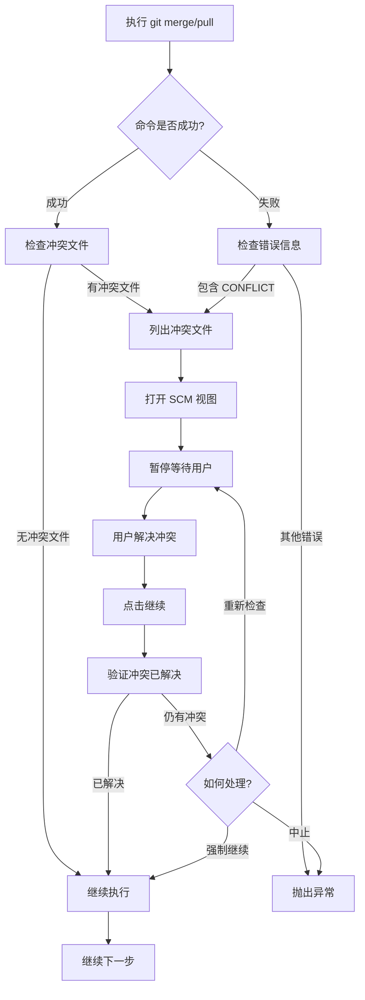

# 快速升级功能优化说明 v2

## 📋 优化内容

### 1. ✅ 智能冲突检测与处理

**问题**：之前固定在合并后暂停，即使没有冲突也要手动继续。

**优化**：
- ✅ 新增 `checkConflictFiles()` 方法，检查是否真的存在冲突文件
- ✅ 新增 `handleConflict()` 方法，统一处理冲突逻辑
- ✅ 只在真正有冲突文件时才暂停流程
- ✅ 列出所有冲突文件，方便用户查看
- ✅ 解决冲突后自动验证是否完全解决

**实现细节**：

```typescript
// 检查冲突文件
private async checkConflictFiles(cwd: string): Promise<boolean> {
  const { stdout } = await execAsync('git diff --name-only --diff-filter=U', { cwd });
  return stdout.trim().length > 0;
}

// 处理冲突
private async handleConflict(cwd: string) {
  // 1. 列出冲突文件
  // 2. 打开 SCM 视图
  // 3. 暂停等待用户解决
  // 4. 验证是否完全解决
}
```

**用户体验**：
- 无冲突：直接继续，不暂停 ⚡
- 有冲突：自动暂停，显示冲突文件列表，等待解决 ⏸️

---

### 2. ✅ 合并到目标分支前二次确认

**问题**：直接合并到目标分支（test-220915 或 sprint-251225）风险较高，没有确认步骤。

**优化**：
- ✅ 在步骤 10 新增确认步骤
- ✅ 显示详细的检查清单
- ✅ 提示用户谨慎操作
- ✅ 用户需要主动点击"继续"才会执行合并

**确认内容**：

```
⚠️  即将合并到目标分支 {targetBranch}

请确认以下信息：
✓ 特性分支 {featureBranch} 已完成升级
✓ 单测已通过（或已知风险）
✓ 代码已推送到远程

注意：此操作将修改 {targetBranch} 分支，请谨慎操作！

确认无误后点击"继续"按钮。
```

**安全保障**：
- 给用户最后一次检查机会
- 防止误操作修改重要分支
- 提醒用户确认关键信息

---

### 3. ✅ 去除固定的冲突处理暂停步骤

**问题**：之前在步骤 4 固定暂停，无论是否有冲突。

**优化**：
- ✅ 去除固定的冲突处理暂停步骤
- ✅ 改为在 `runWithConflictSupport` 中动态检测
- ✅ 流程更加智能和高效

**步骤优化前后对比**：

| 步骤 | 优化前 | 优化后 |
|------|--------|--------|
| 3 | 合入源码分支 | 合入源码分支（自动检测冲突） |
| 4 | **固定暂停：处理冲突** | 执行升级脚本 |
| 5 | 执行升级脚本 | 运行单测 |
| ... | ... | ... |
| 10 | 更新目标分支 | **新增：合并前确认** |
| 11 | 合并到目标分支 | 合并到目标分支（自动检测冲突） |

**总步骤数**：13 步（保持不变，但流程更智能）

---

## 🎯 核心改进

### 智能冲突处理流程



---

## 📝 修改的方法

### 1. `runWithConflictSupport()` - 重构

**修改内容**：
- ✅ 成功执行后也检查冲突文件
- ✅ 检测到冲突时调用 `handleConflict()`
- ✅ 无冲突时直接继续

**代码变化**：
```typescript
// 优化前
if (isConflict || isMergeOrPull) {
  // 直接打开 SCM，不暂停
  await this.openConflictResolver();
  return;
}

// 优化后
if (isConflict || isMergeOrPull) {
  const hasConflicts = await this.checkConflictFiles(cwd);
  if (hasConflicts) {
    await this.handleConflict(cwd);  // 暂停等待
  } else {
    this.output.appendLine('✓ 合并完成，无冲突文件\n');
  }
  return;
}
```

### 2. `checkConflictFiles()` - 新增

**功能**：检查是否存在未解决的冲突文件

**实现**：
```typescript
private async checkConflictFiles(cwd: string): Promise<boolean> {
  const { stdout } = await execAsync('git diff --name-only --diff-filter=U', { cwd });
  const conflictFiles = stdout.trim();
  return conflictFiles.length > 0;
}
```

**使用的 Git 命令**：
- `git diff --name-only --diff-filter=U`
- 列出所有未合并的文件（U = Unmerged）

### 3. `handleConflict()` - 新增

**功能**：统一的冲突处理流程

**步骤**：
1. 列出冲突文件
2. 打开 SCM 视图
3. 暂停流程（调用 `waitForContinue`）
4. 验证冲突是否已解决
5. 提供"重新检查"、"强制继续"、"中止"选项

**代码结构**：
```typescript
private async handleConflict(cwd: string) {
  // 1. 列出冲突文件
  const conflictFiles = await getConflictFiles();
  this.output.appendLine('冲突文件列表：');
  conflictFiles.forEach(file => this.output.appendLine(`  - ${file}`));
  
  // 2. 打开 SCM
  await this.openConflictResolver();
  
  // 3. 暂停等待
  await this.waitForContinue({ ... });
  
  // 4. 验证
  const stillHasConflicts = await this.checkConflictFiles(cwd);
  if (stillHasConflicts) {
    // 提供选项
  }
}
```

---

## 🔍 测试场景

### 场景 1：无冲突合并
```
1. 执行 git pull origin plus-test-250918
2. ✅ 自动检测：无冲突文件
3. ✅ 直接继续，不暂停
4. ✅ 输出：✓ 合并完成，无冲突文件
```

### 场景 2：有冲突合并
```
1. 执行 git pull origin plus-test-250918
2. ⚠️ 检测到冲突
3. ⚠️ 列出冲突文件
4. ⚠️ 打开 SCM 视图
5. ⏸️ 暂停等待用户解决
6. 👤 用户在 SCM 中解决冲突
7. 👤 用户点击"继续"
8. ✅ 验证冲突已解决
9. ✅ 继续执行
```

### 场景 3：合并到目标分支
```
1. 完成特性分支升级
2. 推送特性分支
3. 切回目标分支
4. 更新目标分支
5. ⚠️ **显示确认对话框**
6. 👤 用户检查信息
7. 👤 用户点击"继续"
8. ✅ 执行合并
9. 如有冲突，重复场景 2
```

---

## 📊 优化效果

### 效率提升

| 场景 | 优化前 | 优化后 | 提升 |
|------|--------|--------|------|
| 无冲突 | 需要手动点击"继续" | 自动继续 | ⚡ 100% |
| 有冲突 | 固定暂停 | 智能暂停 | ⚡ 0% |
| 合并到主分支 | 无确认 | 二次确认 | 🛡️ 安全++ |

### 用户体验

| 维度 | 优化前 | 优化后 |
|------|--------|--------|
| 冲突检测 | ❌ 不准确 | ✅ 准确 |
| 流程效率 | ⭐⭐⭐ | ⭐⭐⭐⭐⭐ |
| 安全性 | ⭐⭐⭐ | ⭐⭐⭐⭐⭐ |
| 信息透明度 | ⭐⭐⭐ | ⭐⭐⭐⭐⭐ |

---

## 🎨 日志输出示例

### 无冲突场景
```
> git pull origin plus-test-250918
Already up to date.
✓ 合并完成，无冲突文件

> yarn upgrade
...
```

### 有冲突场景
```
> git pull origin plus-test-250918
Auto-merging src/config/voucherconfig.ts
CONFLICT (content): Merge conflict in src/config/voucherconfig.ts

⚠️  检测到合并冲突，需要手动解决

冲突文件列表：
  - src/config/voucherconfig.ts
  - src/schema/bizSchemaManager.ts

============================================================
⏸️  ⚠️  等待解决合并冲突
冲突处理规则：
(1) voucherconfig 冲突：先保留当前分支版本，之后再覆盖
(2) bizSchemaManager/bizApplication：优先采用当前分支
(3) 引用冲突：对比后按需取新分支
(4) 完成后点击"继续"按钮

👉 请处理完成后执行命令: "Biz Migration: 继续快速升级"
============================================================

[用户解决冲突...]

✅ 继续执行升级流程
✅ 冲突已解决

> yarn upgrade
...
```

### 合并前确认
```
> git checkout test-220915
> git pull origin test-220915

============================================================
⏸️  ⚠️  即将合并到目标分支 test-220915
请确认以下信息：
✓ 特性分支 @upgrade/test/241219 已完成升级
✓ 单测已通过（或已知风险）
✓ 代码已推送到远程

注意：此操作将修改 test-220915 分支，请谨慎操作！

确认无误后点击"继续"按钮。

👉 请处理完成后执行命令: "Biz Migration: 继续快速升级"
============================================================

[用户确认...]

✅ 继续执行升级流程

> git merge @upgrade/test/241219
...
```

---

## 🚀 使用建议

### 1. 正常流程（无冲突）
- ✅ 选择环境
- ✅ 输入分支后缀
- ✅ 等待自动执行
- ✅ 确认合并到目标分支
- ✅ 完成

### 2. 有冲突场景
- ✅ 选择环境
- ✅ 输入分支后缀
- ⚠️ 检测到冲突时会自动暂停
- 👤 在 SCM 视图中解决冲突
- 👤 点击"继续"或执行命令
- ✅ 继续执行后续步骤

### 3. 合并前再次检查
- ✅ 查看特性分支是否完整
- ✅ 确认单测结果
- ✅ 检查代码是否已推送
- ✅ 点击"继续"确认合并

---

## 📌 注意事项

### 1. 冲突处理
- 必须在 SCM 视图中完全解决冲突
- 点击"继续"后会自动验证
- 如仍有冲突，可选择"重新检查"或"强制继续"

### 2. 合并确认
- 这是最后的检查点
- 合并后会直接推送到远程
- 请确保信息无误再继续

### 3. 回滚建议
如果合并后发现问题：
```bash
git reset --hard origin/test-220915  # 回滚本地
git push origin test-220915 --force  # 回滚远程（需谨慎）
```

---

## ✅ 更新清单

- [x] ✅ 新增 `checkConflictFiles()` 方法
- [x] ✅ 新增 `handleConflict()` 方法
- [x] ✅ 重构 `runWithConflictSupport()` 方法
- [x] ✅ 去除固定冲突处理暂停步骤
- [x] ✅ 添加合并前二次确认步骤
- [x] ✅ 更新步骤编号和注释
- [x] ✅ 编译测试通过
- [x] ✅ Linter 检查通过
- [x] ✅ 优化说明文档完成

---

**优化完成！** 🎉

*更新时间: 2024-12-19*

