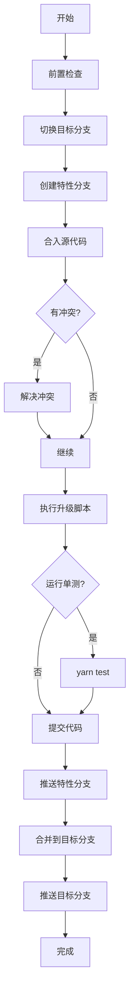

# 🚀 快速升级 - 快速开始

## 一分钟上手

### 1️⃣ 打开命令面板
按 `Cmd+Shift+P`（Mac）或 `Ctrl+Shift+P`（Windows/Linux）

### 2️⃣ 输入命令
输入 `quick upgrade` 或 `快速升级`，选择：
```
Biz Migration: 快速升级（Test/Inte 环境）
```

### 3️⃣ 选择环境
- **Test 环境**：test-220918 ← plus-upgrade-test
- **Inte 环境**：sprint-251225 ← plus-upgrade-sprint

### 4️⃣ 输入分支后缀
例如：`241219`（默认为今天日期）

自动生成特性分支：`@upgrade/test/241219`

### 5️⃣ 等待完成
系统自动执行 13 个步骤，遇到冲突或单测时会暂停等待处理。

---

## 核心步骤



---

## 关键操作

### 处理冲突
1. 系统自动打开 SCM 视图
2. 在 **Merge Changes** 中逐个解决冲突
3. 暂存所有更改
4. 点击通知中的 **"继续"** 按钮

### 单测失败
1. 修复代码
2. 手动运行 `yarn test` 验证
3. 点击 **"继续"** 按钮

### 查看日志
1. 打开输出面板：`Cmd+Shift+U`
2. 选择 **"Biz Quick Upgrade"** 频道

### 取消流程
- 点击进度通知右上角的 **✕** 按钮
- 或在冲突处理时选择 **"取消"**

---

## 环境配置

| 环境 | 目标分支 | 源分支 | 特性分支前缀 |
|------|----------|--------|--------------|
| Test | test-220918 | plus-upgrade-test | @upgrade/test/ |
| Inte | sprint-251225 | plus-upgrade-sprint | @upgrade/inte/ |

---

## 常用命令

```
快速升级（Test/Inte 环境）
Biz Migration: 快速升级（Test/Inte 环境）

继续快速升级流程
Biz Migration: 继续快速升级流程
```

---

## 完成后

1. ✅ 部署环境（pre-test 或 pre-inte）
2. ✅ 验证功能
3. ✅ 观察日志
4. ✅ 回滚预案

---

**详细文档**: 查看 [快速升级使用指南.md](./快速升级使用指南.md)

**问题反馈**: 提供输出日志和错误截图

